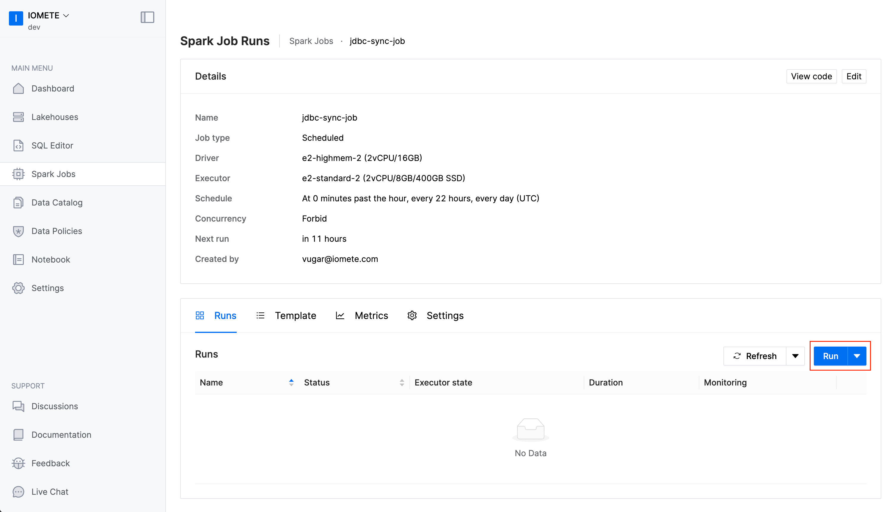

___

**iomete** provides **JDBC Sync Job** to easily replicate tables from JDBC databases (MySQL, PostgreSQL, etc.) to iomete. Only you need to provide configuration properties. Powerful feature of job is **Sync mode**. You can choose a technique that how you want to move your data. Full load or Incremental. You can find more details bellow about sync mode

### Sync Mode

You can define sync mode for each table. Currently, supported sync modes are:

- `FullLoad`: Read everything in the source and overwrites whole table at the destination at each sync
- `IncrementalSnapshot`: It creates the snapshot of table in the destination and only move the newly inserted and updated records. While writing to iomete it uses merge statement. This mode requires 2 parameters: `identification_column` will be used on merge statement, and `tracking_column` to track the where it should continue to get data from the source table

### Installation

- Go to `Spark Jobs`.
- Click on `Create New`.

Specify the following parameters (these are examples, you can change them based on your preference):
- **Name:** `jdbc-sync-job`
- **Schedule:** `0 0/22 1/1 * *`
- **Docker Image:** `iomete/iomete_jdbc_sync:0.2.1`
- **Main application file:** `local:///app/driver.py`
- **Environment Variables:** `DB_PASSWORD`: `9tVDVEKp`
- **Config file:** 
- 
```json
{
    source_connection: {
        type: mysql,
        host: "iomete-tutorial.cetmtjnompsh.eu-central-1.rds.amazonaws.com",
        port: 3306,
        username: tutorial_user,
        password: ${DB_PASSWORD}
    },
    syncs: [
        {
            source.schema: employees
            source.tables: ["*"]
            source.exclude_tables: ["salaries"]
            destination.schema: employees_raw
            sync_mode.type: full_load
        },
        {
            source.schema: employees
            source.tables: [ departments, dept_manager ]
            destination.schema: employees_dep
            sync_mode.type: full_load
        }
    ]
}
```

### Configuration properties

<table>
  <thead>
    <tr>
      <th>Property</th>
      <th>Description</th>
    </tr>
  </thead>

  <tbody>
    <tr>
      <td>
        <code>source_connection</code><br/>
      </td>
      <td>
        <p>Required properties to connect  source.</p>
        <ul>
          <li><code>type</code> your database type like Mysql, Postgres, etc.</li>
          <li><code>host</code> your database host. Example: iomete-tutorial.cetmtjnompsh.eu-central-1.rds.amazonaws.com</li>
          <li><code>port</code> port number. Example: 3306</li>
          <li><code>username</code> database username</li>
          <li><code>password</code> database password</li>
        </ul>
      </td>
    </tr>
    <tr>
      <td>
        <code>syncs</code><br/>
      </td>
      <td>
        <table>
          <tbody>
            <tr>
              <td>
                <code>source.schema</code>
              </td>
              <td>
                <p>Database where your tables stored.</p>
              </td>
            </tr>
            <tr>
              <td>
                <code>source.tables</code>
              </td>
              <td>
                <p>List of tables which you want to replicate. If you want to move all tables set <code>["*"]</code></p>
              </td>
            </tr>
            <tr>
              <td>
                <code>source.exclude_tables</code>
              </td>
              <td>
                <p>List of tables which you <strong>do not want</strong> to replicate.</p>
                <em>(Optional)</em>
              </td>
            </tr>
            <tr>
              <td>
                <code>destination.schema</code>
              </td>
              <td>
                <p>Database name where you want to store tables in your warehouse.</p>
              </td>
            </tr>
            <tr>
              <td>
                <code>type</code>
              </td>
              <td>
                <code>full_load</code> overwrites whole table at the destination at each sync or <code>incremental_snapshot</code> only move the newly inserted and updated records.
                <ul>
                  <li><code>full_load</code></li>
                  <li><code>incremental_snapshot</code>
                    <ul>
                      <li><code>identification_column</code></li>
                      <li><code>tracking_column</code></li>
                    </ul>
                  </li>
                </ul>
              </td>
            </tr>
          </tbody>
        </table>
      </td>
    </tr>
</tbody>
</table>

<br/>


Environment Variables

:::note
You can use **Environment Variables** to store your sensitive variables like password, secrets, etc. Then you can use these variables in your config file using the <code>${DB_PASSWORD}</code> syntax.
:::


Application Config


And, hit the create button.

The job will be run based on the defined schedule. But, you can trigger the job manually by clicking on the `Run` button.



### Github

You can find source code of **JDBC Sync Job** in github. [View in Github](https://github.com/iomete/iomete-jdbc-sync)