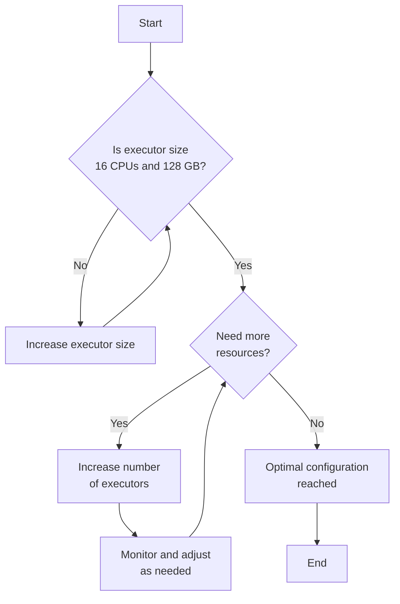

:::info Sizing Spark Workloads in IOMETE: Best Practices and Recommendations
Use larger executors—ideally up to **16 CPUs and 128 GB of memory**—before increasing the number of executors. This approach optimizes performance, reduces Kubernetes overhead, and minimizes the risk of memory-related failures, providing a balanced and efficient environment for your Spark workloads.
:::

## Introduction

Efficiently sizing Spark workloads is crucial for optimizing performance and resource utilization in your data processing tasks. In IOMETE, sizing is based on predefined node types that determine the CPU and memory resources allocated to your Spark workloads. 

This guide provides best practices and recommendations to help you choose the optimal sizing for your Spark workloads, ensuring balanced performance and efficient resource management.

## Understanding Sizing in IOMETE

### Node Types

In IOMETE, [**node types**](node-types) are predefined configurations that specify the amount of CPU and memory resources available for Spark workloads. Platform administrators can define these node types, allowing users to select them when deploying Spark applications such as Lakehouse, Spark Jobs, and Spark Streaming.

- **Customizable**: Users can modify existing node types or define new ones to suit specific workload requirements.
- **Resource Allocation**: Node types determine the CPU and memory allocated to Spark drivers and executors.

### Spark Workloads Components

A typical Spark workload consists of two main components:

1. **Driver**: Coordinates the execution of tasks and maintains information about the Spark application's state.
2. **Executors**: Perform the actual data processing tasks in parallel.

- **Distributed Processing**: Spark leverages multiple executors to process data in parallel across the cluster.
- **Total Cluster Power**: The combined resources of all executors define the total computational power available for processing tasks.

## Choosing the Right Sizing for Spark Workloads

### Recommendation: Use Larger Executors

We **recommend** configuring your Spark workloads with **larger executors**—up to **16 CPUs and 128 GB of memory** per executor—before increasing the number of executors. This strategy provides a balanced configuration that optimizes performance and resource management.

### Advantages of Larger Executors

- **Reduced Kubernetes Overhead**: Fewer executors (pods) mean Kubernetes has fewer pods to manage, improving cluster efficiency.
- **Enhanced Memory Management**: Larger executors have more memory, reducing the risk of processing data that exceeds the executor's memory capacity, which can cause failures.
- **Improved Performance**: Larger executors can handle bigger data partitions, potentially leading to faster task execution times.

### Executor Size vs. Number of Executors

When configuring Spark executors, you have two main variables to consider:

- **Executor Size**: The amount of CPU and memory allocated to each executor.
- **Number of Executors**: The total number of executors running in parallel.

**Example Scenario:**

- **Option 1**: 10 executors, each with 2 CPUs
    - Total CPUs: 10 executors * 2 CPUs = **20 CPUs**
- **Option 2**: 2 executors, each with 10 CPUs
    - Total CPUs: 2 executors * 10 CPUs = **20 CPUs**

Both options provide the same total CPU resources, but using larger executors (Option 2) aligns with our recommendation for the reasons outlined above.

## Best Practices for Executor Sizing

### Optimal Executor Size

- **CPU Allocation**: Aim for executors with **up to 16 CPUs**.
- **Memory Allocation**: Allocate **8 GB of memory per CPU**, resulting in **128 GB of memory** for a 16-CPU executor.
- **Justification**:
    - **Balanced Performance**: 16 CPUs provide an optimal balance between parallel processing capabilities and resource efficiency.
    - **JVM Stability**: Executors larger than 16 CPUs and 128 GB of memory may experience Java Virtual Machine (JVM) inefficiencies, affecting performance.

### CPU to Memory Ratio

- **Standard Ratio**: **1 CPU : 8 GB memory** is considered the best practice.
- **Adjustments Based on Workload**:
    - **CPU-Intensive Workloads**: For tasks that are more CPU-bound (e.g., complex computations with less data), you may opt for a **1 CPU : 4 GB memory** ratio.
    - **Memory-Intensive Workloads**: For data-heavy tasks requiring more memory, maintain or even increase the standard ratio.

### Scaling Executors

1. **Increase Executor Size First**: Begin by scaling up the size of each executor to the optimal size (16 CPUs and 128 GB memory).
2. **Add More Executors**: Once the optimal executor size is reached, increase the number of executors to meet additional resource requirements.

:::note  Flowchart: Choosing Executor Size and Number

:::

## Recommendations

- **Limit Executor Size**: Do not exceed **16 CPUs and 128 GB memory** per executor to prevent JVM performance issues.
- **Optimize Kubernetes Management**: Use larger executors to reduce the number of pods, simplifying Kubernetes operations.
- **Balance Resource Ratios**:
    - For **CPU-bound tasks**, consider a lower memory ratio (e.g., 1 CPU : 4 GB memory).
    - For **memory-bound tasks**, maintain or increase the memory ratio (e.g., 1 CPU : 8 GB memory).
- **Continuous Monitoring**: Regularly monitor your Spark workloads and adjust executor configurations based on performance metrics and resource utilization.

## Conclusion

Choosing the right sizing for your Spark workloads in IOMETE is essential for achieving optimal performance and efficient resource management. By following the best practices outlined in this guide—using larger executors with up to 16 CPUs and 128 GB of memory, maintaining a 1:8 CPU to memory ratio, and scaling the number of executors—you can optimize your Spark applications for computational efficiency and cost-effectiveness.

:::note
These recommendations serve as general guidelines. It's important to consider the specific requirements and characteristics of your workloads. Always monitor your applications and adjust configurations to achieve the best performance.
:::

