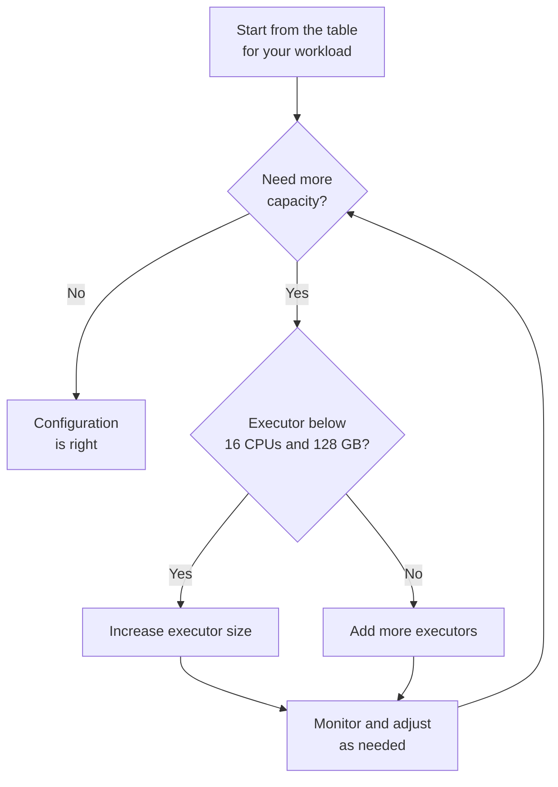

## Introduction

To get the best performance from your Spark workloads, you need to choose the right executor and driver sizing. In IOMETE, sizing is based on predefined node types that determine the CPU and memory resources allocated to your Spark workloads.

Every Spark workload has one driver, which coordinates the work and keeps track of the application's state, and a set of executors, which process the data in parallel. You choose a node type for each of them, and the two follow different rules: because a Spark job and a compute cluster put very different demands on their drivers, this guide treats them separately. Each section gives you a size to start from and tells you what to watch for before you move to a larger one.

Throughout the guide, sizes appear as CPU and memory values rather than node type names, since the names and their exact values differ between on-premises and cloud deployments and your administrator can change them at any time. Select the node type closest to the values you need, or ask your administrator to create one for you.

## Sizing a Spark Job

A Spark job runs from start to finish and then hands its resources back, so what really shapes its sizing is how much data it has to move through in a single run. Find the row that matches your volume and start there.

| Job size | Data per run | Driver | Executor | Executors |
| --- | --- | --- | --- | --- |
| Small | Under 100 GB | 1 vCPU / 8 GiB | 2 vCPU / 16 GiB | 2 |
| Medium | 100 GB to 1 TB | 2 vCPU / 16 GiB | 8 vCPU / 64 GiB | 2-4 |
| Large | Over 1 TB | 4 vCPU / 32 GiB | 16 vCPU / 128 GiB | 4-8 |

These driver sizes assume that the driver only coordinates the work while the executors handle the data, which is true of most jobs. As soon as your job asks the driver to hold data of its own, move one row further down the driver column. That applies when your job:

- Returns data to the driver with `collect()` or `toPandas()`.
- Broadcasts a table larger than 100 MB in a join.
- Runs PySpark. Your Python code runs outside the Java heap, so IOMETE reserves 40% of the driver's memory for it instead of the usual 10%.

There is a limit worth knowing about before you go too far down this path: a single action returns at most 2 GB of results to the driver by default, whatever node type you select, because `spark.driver.maxResultSize` is set to `2048m`. If your job genuinely needs more, raise that property in its Spark configuration, or write the results to a table and read them back from there.

## Sizing a Compute Cluster

A compute cluster works the other way around. Its driver runs as a SQL server that stays up for days and serves everyone connected to it, so the pressure on it comes from how many people query at the same time rather than from how large the tables they query are.

| Cluster size | Concurrent users | Driver | Executor | Executors |
| --- | --- | --- | --- | --- |
| Small | Up to 10 | 2 vCPU / 16 GiB | 2 vCPU / 16 GiB | 2 |
| Medium | 10 to 30 | 4 vCPU / 32 GiB | 8 vCPU / 64 GiB | 2-4 |
| Large | Over 30 | 8 vCPU / 64 GiB, or [more clusters](#supporting-more-than-30-concurrent-users) | 16 vCPU / 128 GiB | 4-8 |

As with a Spark job, move one row further down the driver column when something asks more of the driver than coordination alone. On a compute cluster, that usually means one of two things:

- The cluster runs in single-node mode, where the driver also does the work of the executors.
- The cluster caches many tables, or serves BI dashboards that refresh on a schedule.

### Why Concurrency Drives Driver Size

It is tempting to assume that large query results are what fill up a cluster driver, but they are not. IOMETE returns Thrift results one partition at a time and stores Arrow Flight SQL results in object storage for the client to download, so even a large result set passes through the driver and leaves again.

What stays behind is the state that each connection keeps alive for as long as it is open: its session, its query plans, and the tables it caches or broadcasts. Ten people connected at once means ten copies of all of that sitting in driver memory at the same time, which is why the number of concurrent users tells you more about the size you need than the size of your data does.

### Supporting More Than 30 Concurrent Users

Once you pass roughly 30 concurrent users, a single driver of the sizes listed above starts to struggle, and you have two ways to go from there:

- **Scale up**: move the driver to 8 vCPU / 64 GiB. You keep a single cluster to manage, but a larger Java heap leads to longer garbage collection pauses.
- **Scale out**: create a second compute cluster and split users between them. You have more clusters to manage, but each driver stays small and one heavy user no longer slows everyone else down.

Which one suits you depends on how your users work. Scale out when they run long, heavy queries that would otherwise queue behind each other, and scale up when they run many short ones.

## If the Driver Is Killed Without an OutOfMemoryError

Occasionally Kubernetes kills a driver pod even though the logs contain no `OutOfMemoryError`. First confirm what happened: a pod terminated with reason `OOMKilled` ran out of the memory that sits outside the Java heap, whereas an evicted pod, a failed health check or a lost node all end a driver too and need different fixes.

Once you have confirmed an `OOMKilled` termination, you have two options. A larger node type gives the driver more overhead memory in absolute terms, since IOMETE keeps the same proportion at every size. If that is more memory than the workload needs elsewhere, change the proportion instead: raising `spark.driver.memoryOverheadFactor` from `0.1` to `0.2` takes overhead from about 9% to about 17% of the pod, without making the pod any larger.

That applies to drivers running on the JVM, which includes every compute cluster and any Scala or Java job. A PySpark job already runs at `0.4`, so setting `0.2` there would *reduce* its overhead and make the problem worse. Test the change against your own workload before you apply it more widely, and see [Internal Implementation](./internal-implementation) if you want to follow the calculation yourself.

## Executor Sizing

The tables above give you a starting point for each workload. When a workload needs more capacity than that, increase the size of each executor before you increase their number, up to a ceiling of **16 CPUs and 128 GB of memory** per executor.

### Why Larger Executors Work Better

Suppose a workload needs 20 CPUs in total. You can reach that with ten executors of 2 CPUs each, or with two executors of 10 CPUs each. The totals match, but the two configurations do not behave the same way.

Every executor is a separate pod with its own JVM and its own overhead memory, and it holds its own copy of every table that Spark broadcasts to it. Ten executors therefore mean ten JVMs to start, ten slices of overhead memory taken out of your quota and ten copies of that broadcast table, while Kubernetes has ten pods to schedule and monitor rather than two. Fewer, larger executors also keep more of a shuffle's data on the machine that produced it, which cuts the volume crossing the network.

What larger executors do not give you is more memory per task. The recommended ratio scales CPU and memory together, so each concurrent task ends up with roughly the same memory whichever size you pick. A partition too large for a small executor stays too large for a big one, and the fix for that is repartitioning, not a bigger node type.

### Where the Ceiling Comes From

Two things put the ceiling at 16 CPUs and 128 GB. The first is the JVM: garbage collection pauses grow along with the heap, and a very large heap eventually spends enough time collecting to cancel out the capacity you added.

The second is what happens inside the executor. IOMETE multiplies the vCPU count by a core factor of 1.5, so a 16-CPU executor already runs 24 Spark tasks at the same time (see [Internal Implementation](./internal-implementation) for the calculation). Those tasks share the executor's memory and local disk, and beyond this point they spend more time competing with each other than the extra CPUs give back. An executor also has to fit on a single machine, so the largest one you can actually run is limited by the largest node in your Kubernetes cluster.

### CPU to Memory Ratio

Allocate around **8 GB of memory per CPU**, which is where the 16-CPU and 128 GB pairing comes from and what the default executor node types follow. Adjust the ratio when your workload leans one way or the other: computation-heavy work over relatively little data runs happily at 1 CPU : 4 GB, while wide joins, large aggregations and anything that caches data benefits from 1 : 8 or more.

### Executor Count and Autoscaling

The Executors column in the tables above is a ceiling rather than a fixed count, because both types of workload add and remove executors as the work demands.

A Spark job starts with a single executor and adds more as it needs them, up to the number you set, then releases any executor that has been idle for two minutes. Setting a generous maximum therefore costs you nothing on the runs that do not need it.

A compute cluster with auto scaling enabled, which is the default for multi-node clusters, scales between the minimum and maximum number of executors you configure. Executors scale back down to your minimum after the cluster sits idle for the configured period, 30 minutes by default. Keep the minimum low enough that a quiet cluster is cheap to leave running, and the maximum high enough to absorb your busiest period. See [Creating Clusters](../compute-clusters/creating-clusters.md) for the full range of idle timeout options and how to turn auto scaling off.

:::note  Flowchart: Choosing Executor Size and Number

:::

## Recommendations

If you take away four things from this guide, take these:

- Size a Spark job driver by the data it processes, and a compute cluster driver by the number of people querying at once.
- Grow each executor before you add more of them, and stop at 16 CPUs and 128 GB of memory.
- Keep roughly 8 GB of memory per CPU, adjusting the ratio to suit the workload.
- Treat every size here as a starting point, and revisit it as your data volume, user count and query patterns change.
